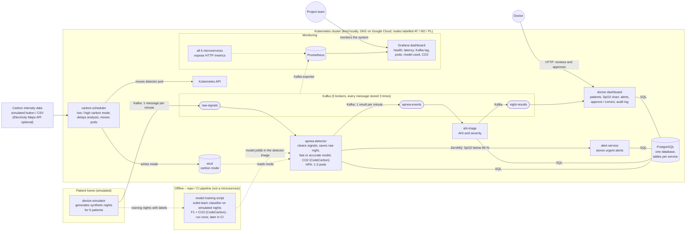

# Component diagram

Source: [archive/30.10_B_component-diagram_v3.mmd](archive/30.10_B_component-diagram_v3.mmd) · Image: [30.10_B_component-diagram_v3.png](30.10_B_component-diagram_v3.png)

```mermaid
%% Component view v2 (aligned with the proposal): 6 microservices, Kafka (3 topics), ZeroMQ for alerts,
%% etcd for the carbon mode, one PostgreSQL, Prometheus + Grafana. Labels on arrows = how components communicate.
flowchart LR
    DOC((Doctor))
    TEAM((Project team))
    CI["Carbon intensity data<br/>simulated button / CSV<br/>(Electricity Maps API optional)"]

    subgraph HOME["Patient home (simulated)"]
        SIM["device-simulator<br/>generates synthetic nights<br/>for 5 patients"]
    end

    subgraph OFF["Offline – repo / CI pipeline (not a microservice)"]
        TRAIN["model training script<br/>scikit-learn classifier on simulated nights<br/>F1 + CO2 (CodeCarbon) · run once, later in CI"]
    end

    subgraph K8S["Kubernetes cluster (kind locally, GKE on Google Cloud; nodes labelled AT / NO / PL)"]

        DET["apnea-detector<br/>cleans signals, saves raw night,<br/>fast or accurate model, CO2 (CodeCarbon)<br/>HPA: 1-3 pods"]
        TRI["ahi-triage<br/>AHI and severity"]
        ALR["alert-service<br/>stores urgent alerts"]
        CAR["carbon-scheduler<br/>low / high carbon mode,<br/>delays analysis, moves pods"]
        DASH["doctor-dashboard<br/>patients, SpO2 chart, alerts,<br/>approve / correct, audit log"]

        subgraph KAFKA["Kafka (3 brokers, every message stored 3 times)"]
            T1(["raw-signals"])
            T2(["apnea-events"])
            T3(["night-results"])
        end

        ETCD[("etcd<br/>carbon mode")]
        DB[("PostgreSQL<br/>one database,<br/>tables per service")]
        K8SAPI["Kubernetes API"]

        subgraph MON["Monitoring"]
            MET["all 6 microservices<br/>expose HTTP /metrics"]
            PROM[("Prometheus")]
            GRAF["Grafana dashboard<br/>health, latency, Kafka lag,<br/>pods, model used, CO2"]
        end
    end

    SIM -->|Kafka: 1 message per minute| T1
    T1 --> DET
    DET -->|Kafka: 1 result per minute| T2
    T2 --> TRI
    TRI -->|Kafka| T3
    T3 --> DASH

    DET -->|ZeroMQ: SpO2 below 80 %| ALR

    CI --> CAR
    CAR -->|writes mode| ETCD
    ETCD -.->|reads mode| DET
    CAR -->|moves detector pod| K8SAPI

    DET ---|SQL| DB
    TRI ---|SQL| DB
    ALR ---|SQL| DB
    DASH ---|SQL| DB

    MET -.-> PROM
    KAFKA -.->|Kafka exporter| PROM
    PROM --> GRAF

    DOC -->|HTTP: reviews and approves| DASH
    TEAM -->|monitors the system| GRAF

    SIM -.->|training nights with labels| TRAIN
    TRAIN -.->|model.joblib in the detector image| DET
```
